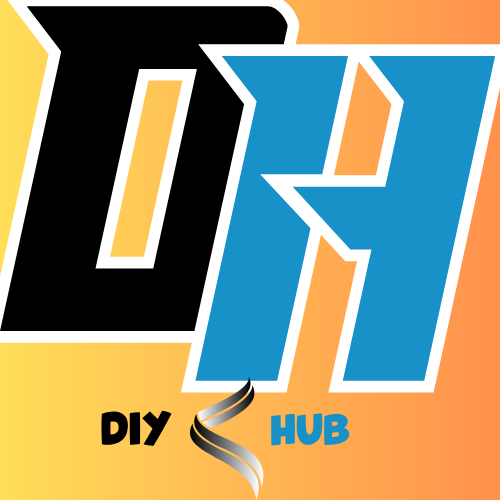
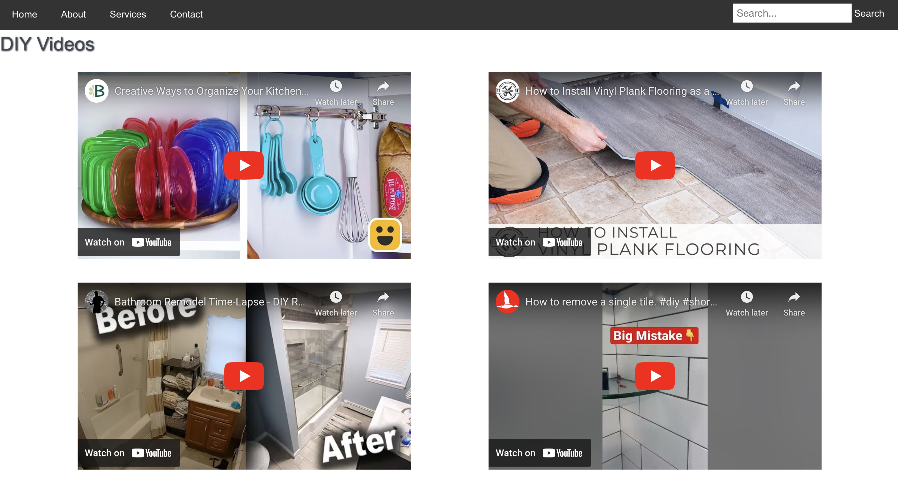

# <DIY Hub>

## Description

We want to have an application to aid users in finding inspiration for home improvement projects through pictures, tutorials, and video, in an effort to improve their home at a fraction of the costs.

## Installation

N/A

## Usage

As you enter our [Home website](index2.html), you can see our logo, along with 4 navigation tags that will one day lead you to the intended tags. In the middle of the page you will find our most basic description of the app, along with a search dropdown modal. When you clicj on one of the selections, you will be redirected to another page where there will be rendered videos related to your selection. 

In [DIY videos](index.html), you wil be able to see videos on the related search using YouTube API. Our app filters the other non related videos to bring you the videos that you need in order to get your home project done. Along with the YouTube API comes its features. You are able to watch the videos in full screen, rewind, pause, ect. This page also includes a "Prev" and "Next" button to browse through new videos or go back to the previous videos. There is also a search bar included in case you want to search for something else. When you click on "About" the website takes you to the quick story of how the app became reality.

To add a screenshot, create an `assets/images` folder in your repository and upload your screenshot to it. Then, using the relative file path, add it to your README using the following syntax:

## Credits

Alejandro Martinez
Alex Tran
Felipe Cordero Delgado

## License

The last section of a high-quality README file is the license. This lets other developers know what they can and cannot do with your project. If you need help choosing a license, refer to [https://choosealicense.com/](https://choosealicense.com/).

## Frameworks

Bulma -CSS 
Youtube- API
Tumblr- API

## How to Contribute

If you created an application or package and would like other developers to contribute to it, you can include guidelines for how to do so. The [Contributor Covenant](https://www.contributor-covenant.org/) is an industry standard, but you can always write your own if you'd prefer.

## Tests

Go the extra mile and write tests for your application. Then provide examples on how to run them here.
